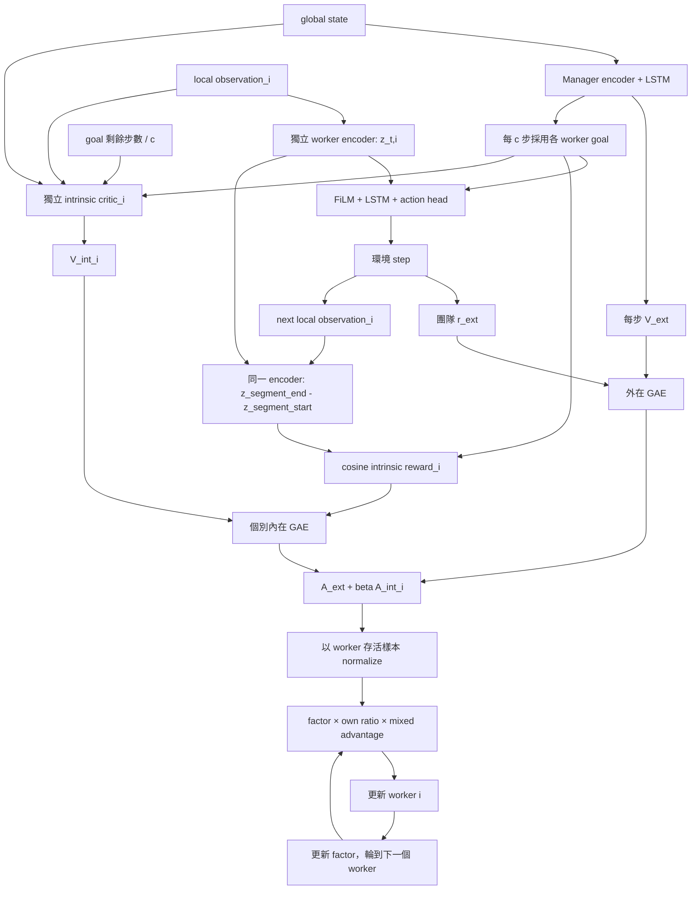

# FeUdal_HAA2C：網路、更新公式與資料流

目前 worker 的學習訊號是團隊外在 advantage 加上自己的內在 advantage。
輪到 worker i 時，整份混合 advantage 乘上前面已更新 workers 的累積比率 factor，
再乘上自己的 importance ratio。Manager 提供共用的外在 V；每個 worker
另有自己的內在 critic。

## 網路組成

記號：N 為 workers 數量，E 為環境數量，T 為 rollout 步數，S 為 global state
維度，O 為 local observation 維度，A 為可用的動作種類數量。
以下 hidden 維度採用此模組目前的 config.yaml。

| 網路 | 輸入與處理 | 輸出 | optimizer |
| --- | --- | --- | --- |
| 一個 Manager | global state → Linear(S,256) → LayerNorm → ReLU → Linear(256,256) → LayerNorm → ReLU → LSTM(256,256) | goal head：Linear(256,N×256)，逐 worker L2 normalize；value head：Linear(256,1) | 一個 Adam，同時負責 goal 與外在 value |
| N 個獨立 worker actors | local observation → Linear(O,256) → LayerNorm → ReLU → Linear(256,256) → LayerNorm → ReLU → FiLM(goal) → ReLU → LSTM(256,256) → Linear(256,A) | masked action logits、categorical policy | 每個 actor 各一個 Adam |
| N 個獨立 intrinsic critics | concat(global state, local observation_i, goal_i, remaining/c) → Linear(S+O+257,128) → LayerNorm → ReLU → Linear(128,128) → LayerNorm → ReLU → Linear(128,1) | 自己的 V_int_i | 每個 critic 各一個 Adam |

總共 1 + 2N 個網路模組及 1 + 2N 個 optimizers。沒有另外建立 worker 的外在 critic。
Intrinsic critic 不共用 worker actor 的 encoder，也沒有 LSTM。

Manager 每一步讀取 global state、更新 hidden/cell、輸出 V_ext。
只有每 c=10 步或新 episode 開始，才採用新 goal；其餘步維持當前 goal。
Worker 和 Manager 的 LSTM 都在 episode 結束後重設；換 goal 本身不重設 LSTM。

Actor 的 pre-FiLM 特徵稱為 z_t,i = f_i(o_t,i)。FiLM 用一個 Linear(256,512)
將 goal 映射成兩組 256 維參數 a_i、b_i，輸出 a_i * z_t,i + b_i。
內在 reward 使用的是調制前的 z，讓 goal 條件不直接混入被比較的狀態特徵。

## 內在獎勵

每個 manager goal segment 結束時，用同一版 worker encoder 計算。令 (s) 為
goal 發出的時刻，(e) 為 goal 替換、worker 死亡或 episode 結束前的最後一個
有效狀態：

\[
\Delta z^{seg}_{s,i}=f_i(o_{e,i})-f_i(o_{s,i}),\qquad
r^{int,seg}_{s,i}=\cos(\Delta z^{seg}_{s,i},g_{s,i}).
\]

方向一致接近 +1、垂直接近 0、反方向接近 -1。Cosine 評估方向，沒有直接獎勵
位移大小。程式使用 eps=1e-8；位移 norm 不大於 eps 時給 0。segment reward 只
寫入該段最後一個有效 worker transition；前面的 transition reward 為 0，GAE 再將
這個結果傳回同一段較早的 action。已死亡的 worker，以及從存活進入死亡的
transition，segment reward 都設為 0，避免把死亡後缺失的 observation 當作達成 goal。

這裡的 g_t,i 是取樣 action 時保存的 goal。next observation 必須是這次 action
造成的環境結果；平行 trainer 會先 store_transition_batch，再 reset 結束的環境。
正常平行訓練會傳入 next_alive_masks；自訂 caller 若省略，視為 alive 狀態未變。

segment reward 在 no_grad 下計算、存進 worker buffer，並且先於任何網路更新。
同一批 rollout 的 reward 在後續 actor/critic epochs 中固定不重算。
Encoder 仍然會在 actor 更新時改變，因此不同 rollout 的特徵空間可能漂移；
這裡沒有使用 frozen/target encoder。

## 兩份 GAE 與兩種 value target

外在 reward r_ext_t 是團隊共同的環境 reward。外在 GAE 使用 Manager 保存的
每步 old_value，episode done 後停止 bootstrap：

\[
\delta^{ext}_t=r^{ext}_t+\gamma(1-d_t)V^{ext}_{t+1}-V^{ext}_t,
\qquad
A^{ext}_t=\delta^{ext}_t+\gamma\lambda(1-d_t)A^{ext}_{t+1}.
\]

內在 critic 預測「目前持有的 goal 在剩餘有效步數內」的折扣內在回報。
令 b_t,i 表示存活，k_t 是執行 action 前的剩餘 goal 步數（10,9,...,1）。
內在延續 mask 為：

\[
m_{t,i}=b_{t,i}b_{t+1,i}(1-d_t)\mathbf{1}[k_t>1].
\]

\[
\delta^{int}_{t,i}=r^{int}_{t,i}+\gamma m_{t,i}V^{int}_{t+1,i}-V^{int}_{t,i},
\qquad
A^{int}_{t,i}=\delta^{int}_{t,i}+\gamma\lambda m_{t,i}A^{int}_{t+1,i}.
\]

因此換 goal、死亡、episode 結束會切斷內在 GAE；換 goal 不會切斷外在 GAE。
在同一 goal 中途截斷 rollout 時，內在尾端 value 使用 next state、next observation、
同一個 goal 與 (k_t-1)/c 來 bootstrap。最後一個 goal action 取得整段的一次
segment reward，但不 bootstrap 到下一個 goal。兩份 GAE 都使用 gamma=0.99、lambda=0.95。

兩種 critic targets 分開計算：

\[
R^{ext}_t=A^{ext}_t+V^{ext,old}_t,\qquad
R^{int}_{t,i}=A^{int}_{t,i}+V^{int,old}_{t,i}.
\]

以上是未 normalization 的 advantage。內在 critic 學未乘 beta 的內在 return。
beta 只用於 actor 的混合 advantage。

## Worker 的 sequential update

每次 rollout 更新重新選擇順序；fixed_order=false 時隨機排列 workers。
factor 初始是每筆 team transition 一個 1，shape 為 [T,E]。

輪到 worker i，先混合，再只用它存活的樣本計算 mean/std：

\[
A^{mix}_{t,i}=A^{ext}_t+\beta A^{int}_{t,i},\qquad
\widehat A_{t,i}=\frac{A^{mix}_{t,i}-\mu_i}{\sigma_i+10^{-5}},
\quad \beta=0.05.
\]

自己的 importance ratio 使用 rollout 保存的 log probability：

\[
\rho_{t,i}(\theta_i)=
\exp\big(\log\pi_{\theta_i}(a_{t,i})-\log\pi^{old}_i(a_{t,i})\big).
\]

PPO 只 clip 當前 worker 的 \(\rho_{t,i}\)，範圍為
\([1-\epsilon,1+\epsilon]\)，目前 \(\epsilon=0.2\)。HAA2C 的
\(factor_t\) 是前序 workers 更新比率的乘積，維持原值而不 clip：

\[
s_{t,i}=\min\left(
\rho_{t,i}\widehat A_{t,i},
\operatorname{clip}(\rho_{t,i},1-\epsilon,1+\epsilon)\widehat A_{t,i}
\right).
\]

Policy loss（以存活樣本數 B_i 正規化）：

\[
L^{policy}_i=-\frac{1}{B_i}\sum_t b_{t,i}
\operatorname{stopgrad}(factor_t)s_{t,i}.
\]

\[
L^{actor}_i=L^{policy}_i-0.01\;\operatorname{mean}_{alive}H(\pi_i).
\]

同一 worker 執行 5 個 actor epochs；期間 factor 固定。PPO ratio clipping
限制的是該 worker 相對於 rollout policy 的變化，不限制前序 worker 的 factor。
它更新完成後，重算相同 action 的 log probability：

\[
factor_t\leftarrow factor_t\times
\exp(\log\pi^{after}_i(a_{t,i})-\log\pi^{before}_i(a_{t,i})).
\]

worker i 在該筆資料已死亡時，傳給後面 workers 的 ratio 設為 1。
整批都沒有存活樣本的 worker 直接跳過。前面傳下來的是 ratio 乘積；
下一個 worker 會使用自己的 A_int。

例如順序 0→1→2，三者分別使用 factor=1、rho_update_0、
rho_update_0*rho_update_1。整份 normalize(A_ext + beta*A_int_i)
都會乘到 factor，不是只對外在項乘 factor。

## Critic 與 Manager 的更新

外在 V 的 rollout 訓練：將 global states 保持 [T,E,S]，從保存的 Manager
rollout-start hidden 重播每一步；每個環境的 terminal mask 分別清除 hidden。
用 R_ext 訓練 Manager encoder、LSTM 與 value head，共 5 個 value epochs。
Value loss 本身不經過 goal head。

各 intrinsic critic：使用自己的 R_int_i，只在 action 當時存活的樣本上取平均，
執行 5 個 epochs。它的輸入與 target detach，梯度只更新自己的 critic。

兩者都沿用 value clipping（0.2）及 Huber loss（delta=10）。若啟用 clipping，
逐樣本採 max(Huber(R-V), Huber(R-V_clipped)) 再取平均；value loss coefficients
目前皆為 1.0。所有 optimizer 的 learning rate 都是 0.0005、Adam eps=1e-5，
gradient norm 上限是 10。

Manager 每個 goal 段落結束或 episode 提前結束時，也保留原本的 goal 更新。
令段落從 u 開始、長度 L≤c：

\[
R^M_u=\sum_{k=0}^{L-1}\gamma^k r^{ext}_{u+k}
+\gamma^L(1-d_{end})V^M_{u+L},\qquad
A^M_u=R^M_u-V^M_u.
\]

段落 bootstrap 使用重播完整段落後的 Manager hidden。Manager 的 goal loss 為：

\[
L^M_{goal}=-\operatorname{stopgrad}(\operatorname{clip}(A^M_u,-15,15))
\frac{\sum_i b_{u,i}\cos(f_i(o_{u+L,i})-f_i(o_{u,i}),g_{u,i})}
{\max(1,\sum_i b_{u,i})}.
\]

再加上段落起點 value 的 SmoothL1(V^M_u, R^M_u)，係數 1.0。
計算這個 cosine 時 worker encoder 的位移 detach，所以這個 loss 只更新 Manager。
Manager 的段落 loss 和 rollout value loss 使用同一個 Manager optimizer。
Manager 的 return 與 value target 都以外在 reward 計算。

## 資料流與時序



1. 取樣時保存 obs、global state、held goal、remaining、action、old log probability、
   old V_ext、old V_int_i、alive、available actions，以及 recurrent rollout 起點。
2. 每個環境 step 後先保存 0 的 r_int_i、intrinsic_done、尾端 intrinsic value，
   同時保存外在 reward、done、外在尾端 value。goal segment 結束時才以段落起終點
   計算一次 r_int_i，寫回該段最後一個有效 transition。
3. Manager 段落結束時進行高層更新。平行路徑在 store_transition_batch 裡完成；
   單環境路徑在下一次 sample_action 收到 reward 時完成。
4. 累積 T=200 步後，先固定外在/內在 GAE 與兩種 targets，再 sequential 更新
   workers，接著訓練 Manager 的每步外在 V，最後更新各 intrinsic critic。
5. 清空 worker buffer、保存新的 rollout-start hidden，繼續取樣。

單環境若 worker rollout 與 Manager goal 同時到期，程式先結束 Manager goal
段落並寫入 segment intrinsic reward，再更新 worker rollout；平行路徑同樣先在
store 中結束 Manager 段落，再由 trainer 觸發 worker rollout 更新。兩種路徑的
intrinsic reward 都會在 actor/critic 更新前固定。

| buffer 訊號 | 平行 shape |
| --- | --- |
| states、observations、goals | [T,E,S]、[T,E,N,O]、[T,E,N,256] |
| external reward、old V_ext、A_ext、factor、remaining | [T,E] |
| intrinsic reward、old V_int、A_int、intrinsic_done、alive | [T,E,N] |
| old log probabilities、actions | [T,E,N] |

## 使用、相容性與驗證

本模組的 intrinsic_coef 目前為 0.05；設為 0 時，actor 的 advantage 回到純外在形式。
worker_ratio_clip 目前為 0.2，必須介於 0 與 1 之間；設得更小會讓 actor 更新更保守。
Intrinsic critics 仍會收集與學習內在回報。平行訓練 console 現在會顯示平均
intrinsic_reward 與 intrinsic_critic_loss，各 worker 的數值保存在 last_per_agent_*
屬性中。

Checkpoint 會保存所有 intrinsic critics 及各自 optimizer。舊 checkpoint 若沒有
這些欄位，可載入 Manager/workers，並提示 intrinsic critics 保持新初始化狀態。

選用方式：在 scripts/smac_feudal/training_config.yaml 設 algorithm: feudal_haa2c，
或執行 train.py 時加 --algorithm feudal_haa2c。平行環境數量由 n_rollout_threads
決定，並不固定在網路內。

執行回歸測試：

```powershell
./.venv-smac/Scripts/python.exe -m unittest discover -s tests -p test_feudal_haa2c.py -v
```

測試包含單環境與平行資料一致性、已知 cosine 方向、死亡與 goal 邊界、recurrent
重播、GAE、critic 梯度隔離，以及用解析 Bernoulli policy gradient 驗證整份混合
advantage 確實乘上累積 factor 和自己的 ratio。

這是加入個別內在目標的實驗性混合算法。其內在 reward 採 goal segment 位移與
該段起點 goal 的 cosine，並限定當前 goal 的回報期間；不是原始 FeUdal 的完整
歷史 goal 平均公式。
[FeUdal 原論文](https://proceedings.mlr.press/v70/vezhnevets17a.html)提供層級 goal 的背景。
原版 [HARL/HAA2C](https://www.jmlr.org/papers/v25/23-0488.html) 的共同目標理論，
不能因為保留 factor 就直接延伸到這個個別內在目標版本；效果仍需用 SC2 訓練評估。
